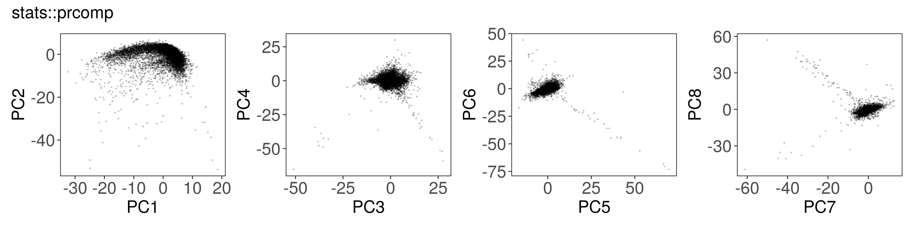
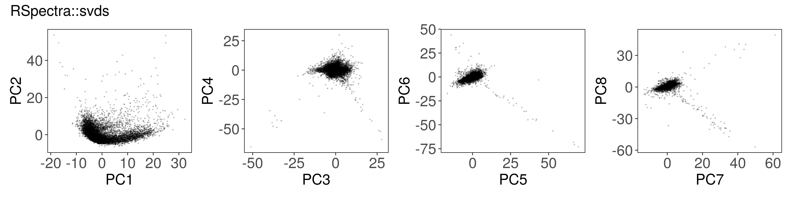
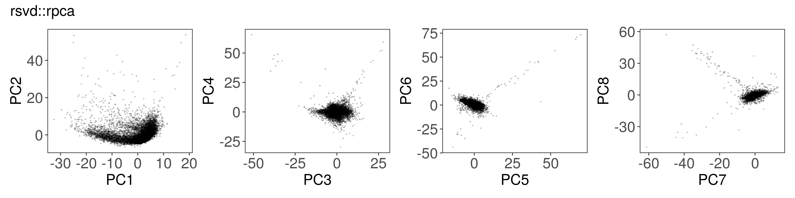
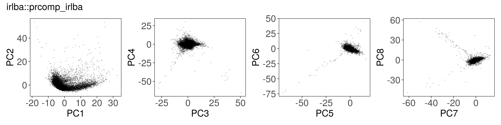
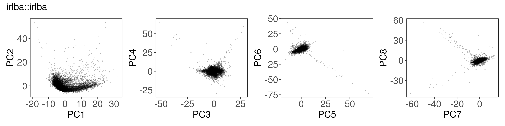
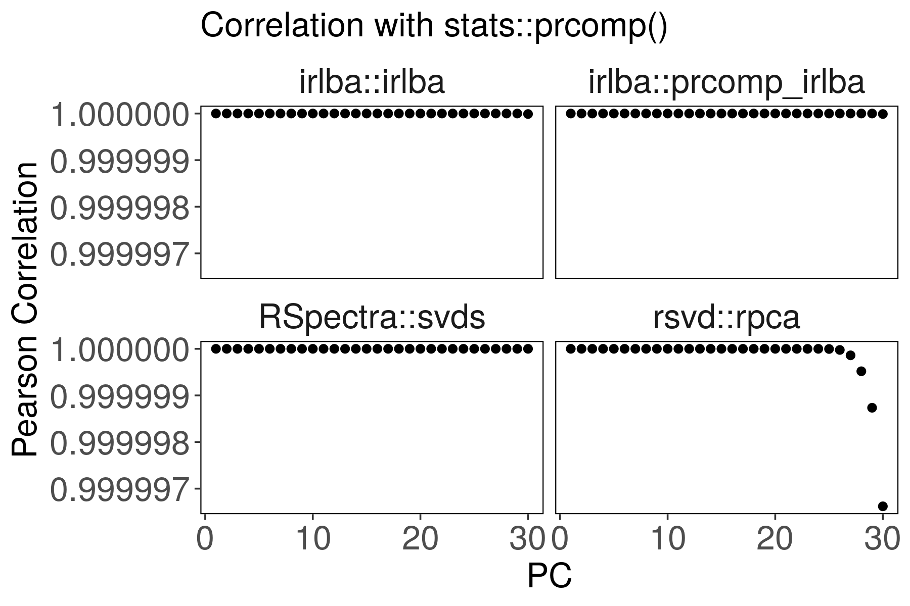
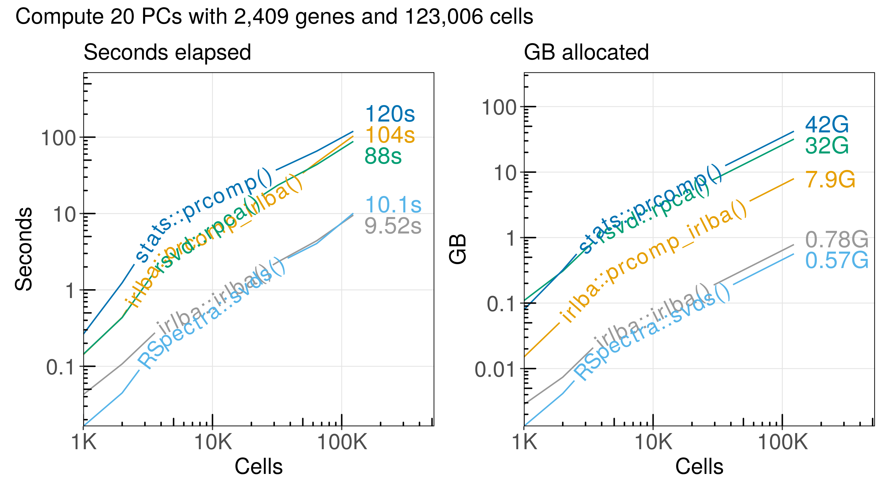

Principal component analysis (PCA) is frequently used for analysis of
single-cell RNA-seq (scRNA-seq) data. We can use it to reduce the
dimensionality of a large matrix with thousands of features (genes) to a
smaller matrix with just a few factors (principal components). Since the latest
scRNA-seq datasets include millions of cells, there is a need for efficient
algorithms. Specifically, we need algorithms that work with sparse matrices
instead of dense matrices. Here, we benchmark five implementations of singular
value decomposition (SVD) and PCA.

<!--more-->

# Introduction to PCA and SVD

For a comprehensive introduction to PCA and how to use it for data analysis, please see:

- [Herve Abdi and Lynne J. Williams. Principal component analysis.][abdi] (27 pages, free PDF)

[abdi]: https://personal.utdallas.edu/~herve/abdi-awPCA2010.pdf


# Compare 5 functions for principal component analysis

`stats::prcomp()` from base R.

`rsvd::rpca()` from the [rsvd] R package by [Ben Erichson].

`RSpectra::svds()` from the [RSpectra] R package by [Yixuan Qiu].

`irlba::prcomp_irlba()` and `irlba::irlba()` From the [irlba] R package by [B. W. Lewis].

[rsvd]: https://github.com/erichson/rSVD
[Ben Erichson]: https://github.com/erichson
[RSpectra]: https://github.com/yixuan/RSpectra
[Yixuan Qiu]:https://github.com/yixuan
[irlba]: https://github.com/bwlewis/irlba
[B. W. Lewis]: https://github.com/bwlewis


```r
install.packages(c("rsvd", "RSpectra", "irlba"))
```


# Load single-cell RNA-seq data

We use the dataset of epithelial (Epi) cells published in an article by
[Smillie et al. 2019][Smillie2019], which is available for download at
[SCP259].

[Smillie2019]: https://doi.org/10.1016/j.cell.2019.06.029
[SCP259]: https://singlecell.broadinstitute.org/single_cell/study/SCP259/intra-and-inter-cellular-rewiring-of-the-human-colon-during-ulcerative-colitis


```r
a1 <- qread("Smillie2019-Epi-counts.qs")
```


Let's count the number of genes (rows) and cells (columns). And let's see how
many entries in the matrix are non-zero:


```r
dim(a1$counts)
```

```
## [1]  20028 123006
```

```r
get_density <- function(x) length(x@x) / x@Dim[1] / x@Dim[2]

get_density(a1$counts)
```

```
## [1] 0.07080145
```


Next, let's normalize the unique molecular identifier (UMI) counts to log1p
counts per million (CPM). We use the median of the number of UMIs per cell as
the scaling factor for all cells.


```r
counts_to_cpm <- function(A, norm = median(Matrix::colSums(A))) {
  A@x <- A@x / rep.int(Matrix::colSums(A), diff(A@p))
  A@x <- norm * A@x
  return(A)
}
a1$logcpm <- log1p(counts_to_cpm(a1$counts))
```

Before we run PCA, let's filter the set of features (genes) in our dataset. We
exclude 37 mitochondrial genes that begin with the string "MT-", because we're
interested in the variation of other genes. Next, we use [loess regression] to
model the relationship between log10(mean) and log10(sd) for each gene,
computed from the raw counts. We select the genes with highest residual
variance from that model.

[loess regression]: https://en.wikipedia.org/wiki/Local_regression


```r
# Exclude MT genes
mito_genes <- rownames(a1$counts)[which(str_detect(rownames(a1$counts), "^MT-"))]

# Fit a model from raw counts that captures log10(sd) ~ log10(mean)
a1$loess <- do_loess(a1$counts, exclude_genes = mito_genes, loess_span = 0.1, min_percent = 0.1)

# Select genes with greatest residual variation
a1$selected_genes <- (
  a1$loess$est %>%
  filter(!is.na(residuals)) %>%
  mutate(selected = residuals > quantile(residuals, 0.85)) %>%
  filter(selected)
)$gene

mat <- a1$logcpm[a1$selected_genes,]
```


# Run PCA or SVD with each function

Below, we can see how to run PCA with each function, along with a plot of the
first few factors (e.g., from `mat_prcomp$x` or `mat_svds$x`) returned by each
function. The plots look nearly identical, except that the sign is sometimes
flipped. The sign flips are expected and will not affect downstream results.


## stats::prcomp()


```r
mat_prcomp <- prcomp(t(mat), center = TRUE, scale = TRUE, rank. = n_pcs)
```



## Rspectra::svds()


```r
mat_svds <- RSpectra::svds(
  A    = t(mat),
  k    = n_pcs,
  opts = list(center = TRUE, scale = TRUE)
)
mat_svds$d <- mat_svds$d * sqrt(nrow(mat_svds$u) - 1)
mat_svds$x <- mat_svds$u %*% diag(mat_svds$d)
```



## rsvd::rpca()


```r
mat_rpca <- rsvd::rpca(
  A      = t(mat),
  k      = n_pcs,# number of dominant principle components to be computed
  center = TRUE, # zero center the variables
  scale  = TRUE, # unit variance the variables
  retx   = TRUE, # return rotated variables
  p      = 20,   # oversampling parameter for rsvd (default p=10)
  q      = n_pcs - 1, # number of additional power iterations for rsvd (default q=1)
  rand   = TRUE  # if (TRUE), the rsvd routine is used, otherwise svd is used
)
```



## irlba::prcomp\_irlba()


```r
mat_irlba <- irlba::prcomp_irlba(
  x      = t(mat),
  n      = n_pcs,
  center = TRUE,
  scale. = TRUE
)
```



## irlba::irlba()


```r
mat_irlba2 <- irlba::irlba(
  A      = t(mat),
  nv     = n_pcs,
  center = Matrix::rowMeans(mat),
  scale  = proxyC::rowSds(mat)
)
mat_irlba2$x <- mat_irlba2$u %*% diag(mat_irlba2$d)
```




# All of the PCA results are similar to each other

We expect slight fluctuations in the outputs due to implementation details, but
the results should be similar between all of the functions. 

The [root mean squared
error](https://en.wikipedia.org/wiki/Root-mean-square_deviation) might be a
reasonable metric to assess similarity of two vectors:


```r
# Root Mean Squared Error
rmse <- function(x, y) sqrt( sum((x - y) ^ 2) / length(x) )
```

The factor scores are similar to what we get from `stats::prcomp()`:


```r
rbindlist(lapply(
  list("mat_svds", "mat_rpca", "mat_irlba", "mat_irlba2"),
  function(x) {
    list(
      method = x,
      rmse = rmse( abs( mat_prcomp$x[,1] ), abs( get(x)$x[,1] ) )
    )
  }
)) %>% mutate_if(is.numeric, signif, 2)
```

```
##        method    rmse
## 1:   mat_svds 7.6e-09
## 2:   mat_rpca 1.1e-13
## 3:  mat_irlba 2.9e-14
## 4: mat_irlba2 5.7e-14
```

Suppose the `stats::prcomp()` output is correct. Are the other outputs
correlated?



For `rsvd::rpca()`, the last PCs are slightly less correlated with
`stats::prcomp()`. We can improve the correlation by increasing `p` and `q`
parameters.


# Run time and memory usage with increasing number of cells

The latest scRNA-seq datasets have millions of cells, so it's important to find
methods that can handle large datasets.

We use the [bench] R package to measure run time and memory usage for each function:

[bench]: https://github.com/r-lib/bench


```r
mat <- a1$logcpm[a1$selected_genes,]
dim(mat)
```

```
## [1]   2409 123006
```

```r
mat_meta <- a1$obs[match(colnames(mat), a1$obs$NAME),]
all(mat_meta$NAME == colnames(mat))
```

```
## [1] TRUE
```

```r
# Helper function to take a subset of cells from mat
prep_matrix <- function(n_cells) {
  set.seed(42)
  X <- mat[,sample.int(n = ncol(mat), size = n_cells)]
  if (nrow(X) > ncol(X)) { # If more genes than cells, use fewer genes
    X <- X[1:(ncol(X)/2),]
  }
  X <- X[rowSums(X) > 0,]
  X <- X[,colSums(X) > 0]
  return(X)
}

file_bench <- "pca-benchmark.tsv"
if (file.exists(file_bench)) {

  d <- fread(file_bench)

} else {

  pca_bench <- bench::press(
    n_cells = c(1000, 2000, 4000, 8000, 32000, 64000, 123006),
    {
      X <- prep_matrix(n_cells)
      bench::mark(
        check = FALSE,
        time_unit = 's',
        max_iterations = 5,
        "stats::prcomp()" = {
          prcomp(t(X), center = TRUE, scale = TRUE, rank. = 20)
        },
        "RSpectra::svds()" = {
          retval <- RSpectra::svds(A = t(X), k = 20, opts = list(center = TRUE, scale = TRUE))
          retval$d <- retval$d * sqrt(nrow(retval$u) - 1)
          retval$x <- retval$u %*% diag(retval$d)
          retval
        },
        "irlba::prcomp_irlba()" = {
          irlba::prcomp_irlba(x = t(X), n = 20, center = TRUE, scale. = TRUE)
        },
        "irlba::irlba()" = {
          X_center <- rowMeans(X)
          X_scale <- proxyC::rowSds(X)
          suppressWarnings({
            retval <- irlba::irlba(A = t(X), nv = 20, center = X_center, scale = X_scale)
          })
          retval$x <- retval$u %*% diag(retval$d)
          retval
        },
        "rsvd::rpca()" =  {
          rsvd::rpca(
            A = t(X), k = 20, center = TRUE, scale = TRUE, retx = TRUE,
            p = 10, q = 19, rand = TRUE
          )
        }
      )
    }
  )

  pca_bench$method = attr(pca_bench$expression, "description")
  fwrite(
    x = as_tibble(pca_bench) %>% select(-expression, -result, -memory, -time, -gc),
    file = file_bench,
    sep = "\t"
  )

}
```

The run time and memory usage of each algorithm increases in proportion to the
number of cells we analyze:



Here is a summary of the performance:


|method                |n_cells |seconds |gb    |cells_per_second |cells_per_gb |
|:---------------------|:-------|:-------|:-----|:----------------|:------------|
|stats::prcomp()       |123,000 |120.00  |42.10 |1,030            |2,920        |
|irlba::prcomp_irlba() |123,000 |104.00  |7.93  |1,190            |15,500       |
|rsvd::rpca()          |123,000 |88.00   |31.90 |1,400            |3,850        |
|RSpectra::svds()      |123,000 |10.10   |0.56  |12,200           |218,000      |
|irlba::irlba()        |123,000 |9.52    |0.78  |12,900           |157,000      |

# Conclusions

The functions `RSpectra::svds()` and `irlba::irlba()` are the most efficient
for computing the SVD for a sparse matrix with single-cell RNA-seq data.

The `RSpectra::svds()` function has the most efficient memory usage, but it is
almost the same as `irlba::irlba()`.

[Matrix]: https://CRAN.R-project.org/package=Matrix

## How large is the matrix after manually scaling each gene?

After scaling, most of the entries in the matrix will no longer be equal to
zero. So, the resulting matrix will be represented as a dense matrix instead.
We often want to avoid forming the dense matrix in order to avoid using more
memory.

How large is the resulting dense matrix?


```r
# Center and scale each row of a sparse matrix.
scale_data <- function(X) {
  X_mean <- Matrix::rowMeans(X)
  X_std <- proxyC::rowSds(X)
  X <- as.matrix(X - X_mean)
  X <- X / X_std
  X[is.na(X)] <- 0
  return(X)
}
```


```r
# The sparse matrix with logcpm values
size1 <- pryr::object_size(mat)
size1
```

```
## 325,439,488 B
```

```r
# The dense matrix with scaled (mean 0 variance 1) values
size2 <- pryr::object_size(scale_data(mat))
size2
```

```
## 2,381,553,440 B
```

The memory allocation increases 7.3-fold for the dense
scaled matrix. Note that irlba and RSpectra manage to effectively scale the
data without allocating 2.38 GB of memory!


## What is the maximum number of cells we can analyze in R?

One way to address this question is to check how much memory is allocated for a
matrix with different sizes, but with the same density as a real data matrix.


```r
# Density of a real scRNA-seq matrix is usually between 5% and 10%
length(mat@x) / (mat@Dim[1] * mat@Dim[2])
# 0.088

sim <- rsparsematrix(nrow = 2409, ncol = 1e6, density = 0.088)
pryr::object_size(sim)
# 2.55 GB

sim <- rsparsematrix(nrow = 2409, ncol = 2e6, density = 0.088)
pryr::object_size(sim)
# 5.1 GB
```

It seems that we need about 2.55G of memory per million cells if we keep 2,409
genes per cell.

If we assume 0.088 density and 2409 genes, then we might expect to be able to
analyze up to 10 or 11 million cells before we hit [the 32 bit
limit](https://stackoverflow.com/questions/16446154/create-a-very-large-sparse-matrix-in-r).


```r
2409 * 11e6 * 0.088 > .Machine$integer.max
```

```
## [1] TRUE
```

It may be more realistic to assume 0.088 density and 20,000 genes. We'll want
to compute statistics for each gene first, and then pass the filtered matrix to
downstream functions. That means we will already hit the 32 bit limit when we
try to read a counts matrix with 2 million cells and 20,000 genes:


```r
2e4 * 2e6 * 0.088 > .Machine$integer.max
```

```
## [1] TRUE
```

# Source code

The [source code] for this note is available for you to read.

[source code]: https://github.com/slowkow/slowkow.com/tree/master/content/notes/pca-benchmark/index.Rmd


Here are the version numbers of the tested packages at the time of writing:


|         |version |url                                       |
|:--------|:-------|:-----------------------------------------|
|RSpectra |0.16.0  |https://github.com/yixuan/RSpectra        |
|rsvd     |1.0.5   |https://github.com/erichson/rSVD          |
|irlba    |2.3.5   |https://github.com/bwlewis/irlba          |
|Matrix   |1.4.0   |https://CRAN.R-project.org/package=Matrix |
|proxyC   |0.2.4   |https://github.com/koheiw/proxyC          |

# Related work

This tutorial explains how to use `RSpectra::svds()` to get the same results as
`stats::prcomp()`:

- https://statr.me/2019/11/rspectra-center-scale/

This benchmark compares different functions for PCA on large dense matrices:

- https://privefl.github.io/blog/fast-r-functions-to-get-first-principal-components/

PCA implementation for sparse matrices in Python:

- https://github.com/niitsuma/delayedsparse/

# Session information

Here are the version numbers for all of the software:

<details><summary>Session info</summary>

```r
sessionInfo()
```

```
## R version 4.1.0 (2021-05-18)
## Platform: x86_64-pc-linux-gnu (64-bit)
## Running under: Ubuntu 18.04.5 LTS
## 
## Matrix products: default
## BLAS:   /usr/lib/x86_64-linux-gnu/openblas/libblas.so.3
## LAPACK: /usr/lib/x86_64-linux-gnu/libopenblasp-r0.2.20.so
## 
## locale:
##  [1] LC_CTYPE=en_US.UTF-8       LC_NUMERIC=C              
##  [3] LC_TIME=en_US.UTF-8        LC_COLLATE=en_US.UTF-8    
##  [5] LC_MONETARY=en_US.UTF-8    LC_MESSAGES=en_US.UTF-8   
##  [7] LC_PAPER=en_US.UTF-8       LC_NAME=C                 
##  [9] LC_ADDRESS=C               LC_TELEPHONE=C            
## [11] LC_MEASUREMENT=en_US.UTF-8 LC_IDENTIFICATION=C       
## 
## attached base packages:
## [1] stats     graphics  grDevices utils     datasets  methods   base     
## 
## other attached packages:
##  [1] geomtextpath_0.1.0   qs_0.25.2            data.table_1.14.2   
##  [4] scattermore_0.7      scales_1.1.1         glue_1.6.1          
##  [7] ggrepel_0.9.1        microbenchmark_1.4.9 forcats_0.5.1       
## [10] stringr_1.4.0        dplyr_1.0.8          purrr_0.3.4         
## [13] readr_2.1.1          tidyr_1.1.4          tibble_3.1.6        
## [16] tidyverse_1.3.1      patchwork_1.1.1      ggplot2_3.3.5       
## [19] knitr_1.37           irlba_2.3.5          Matrix_1.4-0        
## [22] rsvd_1.0.5           RSpectra_0.16-0     
## 
## loaded via a namespace (and not attached):
##  [1] httr_1.4.2          bit64_4.0.5         jsonlite_1.7.3     
##  [4] modelr_0.1.8        RcppParallel_5.1.5  assertthat_0.2.1   
##  [7] highr_0.9           cellranger_1.1.0    pillar_1.7.0       
## [10] backports_1.4.1     lattice_0.20-44     digest_0.6.29      
## [13] pryr_0.1.5          rvest_1.0.2         colorspace_2.0-2   
## [16] stringfish_0.15.5   pkgconfig_2.0.3     broom_0.7.11       
## [19] haven_2.4.3         lobstr_1.1.1        RApiSerialize_0.1.0
## [22] tzdb_0.2.0          generics_0.1.2      farver_2.1.0       
## [25] ellipsis_0.3.2      withr_2.4.3         hexbin_1.28.2      
## [28] cli_3.2.0           magrittr_2.0.2      crayon_1.5.0       
## [31] readxl_1.3.1        evaluate_0.14       fs_1.5.2           
## [34] fansi_1.0.2         xml2_1.3.3          textshaping_0.3.6  
## [37] tools_4.1.0         hms_1.1.1           lifecycle_1.0.1    
## [40] munsell_0.5.0       reprex_2.0.1        compiler_4.1.0     
## [43] proxyC_0.2.4        systemfonts_1.0.3   rlang_1.0.1        
## [46] grid_4.1.0          rstudioapi_0.13     labeling_0.4.2     
## [49] codetools_0.2-18    gtable_0.3.0        DBI_1.1.2          
## [52] R6_2.5.1            lubridate_1.8.0     bit_4.0.4          
## [55] utf8_1.2.2          ragg_1.2.1          scico_1.3.0        
## [58] stringi_1.7.6       Rcpp_1.0.8          vctrs_0.3.8        
## [61] dbplyr_2.1.1        tidyselect_1.1.1    xfun_0.29
```
</details>


