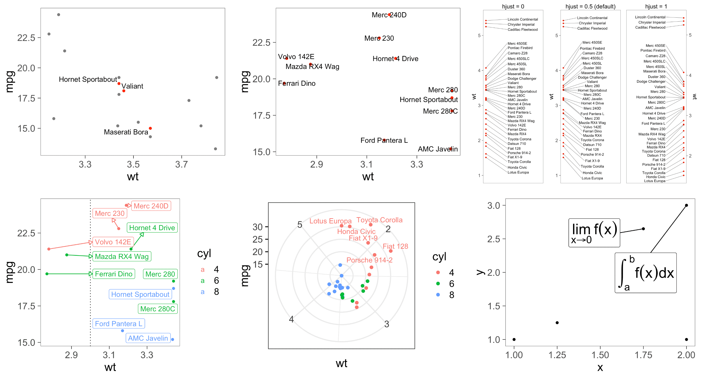

```{r setup, include=FALSE}
options(htmltools.dir.version = FALSE)
library(dplyr)
library(gridExtra)
library(patchwork)
library(ggplot2)
library(ggrepel)
library(scales)
library(sitools)
library(knitr)
library(cranlogs)
library(fractional)
opts_chunk$set(
  cache = TRUE,
  pngquant = "--speed=1 --quality=0-10"
)
knit_hooks$set(
  pngquant = hook_pngquant
)
theme_set(theme_classic(base_size = 18) %+replace% theme(
  # axis.line.y = element_line(colour = "black", size = 0.2),
  # axis.line.x = element_line(colour = "black", size = 0.2),
  axis.ticks   = element_line(colour = "black", size = 0.3),
  panel.border = element_rect(size = 0.3, fill = NA),
  axis.line    = element_blank(),
  plot.title   = element_text(size = 18, vjust = 2, hjust = 0.5)
))
```

class: title-slide-custom, center

# Introduction to **ggrepel**

.large[

</img>

[github.com/slowkow/ggrepel](https://github.com/slowkow/ggrepel)

July 2018

Kamil Slowikowski <br> [@slowkow](https://twitter.com/slowkow)
]

???

- Hello! I'm Kamil Slowikowski, the creator of ggrepel.

- I'm also a PhD student in Bioinformatics at Harvard.

- I want to show you a brief introduction to ggrepel, so you can get started
  using it in your figures.

---

# &#x1F61E; **Problem:** text placement

.pull-left[
<br>
```{r tidy=FALSE, eval=FALSE}
library(ggplot2)

ggplot(mtcars) + 
  aes(
    x = wt, y = mpg,
    label = rownames(mtcars)
  ) + 
  geom_point(color = "red") +
  geom_text() #<<
```
]

.pull-right[
```{r problem, echo=FALSE, fig.height=4, fig.width=4, dpi=200}
set.seed(42)

dat <- subset(mtcars, wt > 2.75 & wt < 3.45)
dat$car <- rownames(dat)

p <- ggplot(dat, aes(wt, mpg, label = car)) +
  geom_point(color = "red")

p1 <- p + geom_text() + labs(title = "geom_text()")

p1
```
]


???

- Oftentimes, we want to know the identity of each data point in a figure.

- Unfortunately, `geom_text()` does not always work as expected:
  
  - text labels often overlap with each other
    
  - sometimes they fall outside the plotting area

---

# &#x1F389; **Solution:** ggrepel

.pull-left[
<br>
```{r tidy=FALSE, eval=FALSE}
library(ggrepel)

ggplot(mtcars) + 
  aes(
    x = wt, y = mpg,
    label = rownames(mtcars)
  ) + 
  geom_point(color = "red") +
  geom_text_repel() #<<
```
]

.pull-right[
```{r solution, echo=FALSE, fig.height=4, fig.width=4, dpi=200}
set.seed(42)

dat <- subset(mtcars, wt > 2.75 & wt < 3.45)
dat$car <- rownames(dat)

p <- ggplot(dat, aes(wt, mpg, label = car)) +
  geom_point(color = "red")

p2 <- p + geom_text_repel() + labs(title = "geom_text_repel()")

p2
```
]

???

- This problem motivated me to create ggrepel:
  
  - an extension for ggplot2 that automatically places text labels without
    overlaps

- I tried to make it very easy to use:

  - just replace `geom_text()` with `geom_text_repel()`

---

# &#x1F60A; Much better!

```{r ex1, echo=FALSE, fig.height=4, fig.width=8, dpi=200}
set.seed(42)

dat <- subset(mtcars, wt > 2.75 & wt < 3.45)
dat$car <- rownames(dat)

p <- ggplot(dat, aes(wt, mpg, label = car)) +
  geom_point(color = "red")

p1 <- p + geom_text() + labs(title = "geom_text()")

p2 <- p + geom_text_repel() + labs(title = "geom_text_repel()")

gridExtra::grid.arrange(p1, p2, ncol = 2)
```

???

- Side by side, you can see that the figure using ggrepel is much
  easier to read because the text is clearly visible.

---

# **Repel** text labels away from

.pull-left-large[
<br>
- other text labels

- data points

- edges of the plotting area
]

.pull-right[
```{r ex2, echo=FALSE, fig.height=4, fig.width=4, dpi=200}
set.seed(42)

dat <- subset(mtcars, wt > 2.75 & wt < 3.45)
dat$car <- rownames(dat)

p2 <- p + geom_text_repel() + labs(title = "geom_text_repel()")

p2
```
]


???

- The idea behind ggrepel is very simple.

- We want to repel text labels away from:

  - other text labels

  - data points

  - and edges of the plotting area

---

# &#x1F4DC; Algorithm

.large[
$O(n^2)$ N-body physical simulation
]

```{r algorithm, echo=FALSE, fig.height=2.5, fig.width=4.5, dpi=300}
d <- data.frame(x = c(1, 2), y = c(1,1))
d_t <- data.frame(
  x = c(1.35, 1.64),
  y = c(1.2, 1.22),
  z = c("Text1", "Text2")
)
d_s <- d_t
d_s$y <- d_s$y + 0.1
d_s <- cbind(d_s[1, 1:2], d_s[2,1:2])
colnames(d_s) <- c("x", "y", "xend", "yend")
d_s2 <- cbind(d, d_t)
colnames(d_s2) <- c("x", "y", "xend", "yend", "z")
d_s3 <- d_s2
d_s3[1,c("x", "xend")] <- d_s3[1,c("x", "xend")] + 0.07
d_s3[2,c("x", "xend")] <- d_s3[2,c("x", "xend")] - 0.07
d_s3[1,c("y", "yend")] <- d_s3[1,c("y", "yend")] - 0.07
d_s3[2,c("y", "yend")] <- d_s3[2,c("y", "yend")] - 0.07
ggplot() +
  geom_segment(
    data = d_s2,
    mapping = aes(x, y, xend = xend, yend = yend),
    size = 1
  ) +
  geom_point(
    data = d,
    mapping = aes(x, y),
    size = 5
  ) +
  geom_label(
    data = d_t,
    mapping = aes(x, y, label = z),
    size = 10,
    alpha = 0.5
  ) +
  geom_segment(
    data = d_s,
    mapping = aes(x, y, xend = xend, yend = yend),
    arrow = arrow(ends = "both"),
    color = "red",
    size = 2
  ) +
  geom_segment(
    data = d_s3,
    mapping = aes(x, y, xend = xend, yend = yend),
    size = 2,
    color = "blue",
    arrow = arrow(ends = "first")
  ) +
  annotate(
    geom = "text",
    x = 1.5,
    y = 1.42,
    label = "Repel!",
    color = "red",
    angle = 7,
    size = 10
  ) +
  annotate(
    geom = "text",
    x = 1.5,
    y = 1.0,
    label = "Attract!",
    color = "blue",
    angle = -7,
    size = 10
  ) +
  scale_x_continuous(limits = c(0.9, 2.1)) +
  scale_y_continuous(limits = c(0.85, 1.5)) +
  labs(x = NULL, y = NULL) +
  theme(axis.ticks = element_blank(),
        axis.text = element_blank())
```

???

- I implemented a brute force algorithm of a physical simulation.

- We iterate over all pairs of text labels and repel them away from each other.

- We use a spring force to pull each text label back to its own data point.

- Let's see it in action!

---

# &#x1F40E; **ggrepel** in action

<video src="index_files/animation.mp4" type="video/mp4" style="height:75%; margin-left:8%;" muted autoplay loop></video>

???

- This is an animation showing each step of the simulation on a loop.

- The labels repel away from each other, and away from data points.

- There is a spring force that pulls each label back to its own data point.

- Notice that "Honda Civic" first moves away from its data point, and then
  it is pulled back until it is directly adjacent.

---

# &#x1F40E; **ggrepel** in action

<video src="index_files/resizing.mp4" type="video/mp4" style="height:70%; margin-left:8%;" muted autoplay loop></video>

???

- ggrepel works well with RStudio.

- When you resize the plotting area, it will automatically recompute
  the overlaps and adjust the label positions.

---

# &#x1F4BE; Installation

.pull-left-large[
Install **ggrepel** from [CRAN](https://CRAN.R-project.org/package=ggrepel):

```{r eval=FALSE, tidy=FALSE}
install.packages("ggrepel")
```

]

.pull-right[
```{r downloads, echo=FALSE, fig.height=2, fig.width=3.5, dpi=300}

downloads <- cranlogs::cran_downloads(
  packages = "ggrepel",
  from = "2016-01-09",
  to = Sys.Date()
)
downloads$date <- as.Date(downloads$date)
downloads$count_sum <- cumsum(downloads$count)
ggplot(downloads, aes(date, count_sum)) +
  stat_smooth(method = "loess", color = "black") +
  scale_y_continuous(
    labels = scales::comma_format(),
    breaks = c(0, round(max(downloads$count_sum) / 1e3) * 1e3)
  ) +
#  geom_label_repel(
#    data = data.frame(
#      date = as.Date("2016-01-09"),
#      count_sum = 4e5,
#      label = "ggrepel\nwas created"
#    ),
#    mapping = aes(date, count_sum, label = label),
#    nudge_y = 4e5,
#    arrow = arrow(type = "open", length = unit(0.5, "lines"))
#  ) +
  labs(x = NULL, y = NULL, title = "ggrepel downloads")
  ggsave("ggrepel-downloads.png", width = 0.3 * 12.00, height = 0.3 * 6.75)

```
]

???

- ggrepel is easy to install and only depends on ggplot2. It has no
  other dependencies.

- This has quickly become the most popular piece of code I have ever written.

- I've learned that people are happy when something just works.

- Now let's take a look at a practical example.

---

# &#x1F30B; Example: Volcano

.large[Which genes show significant differential expression?]

```{r volcano, echo=FALSE, fig.height=7, fig.width=16, dpi=200}
# Load packages

# Read data from the web
url <- "https://gist.githubusercontent.com/stephenturner/806e31fce55a8b7175af/raw/1a507c4c3f9f1baaa3a69187223ff3d3050628d4/results.txt"

results <- read.table(url, header=TRUE)
results <- mutate(results, sig=ifelse(results$padj<0.05, "FDR<0.05", "Not Sig"))

results$label <- ""
ix <- results$padj < 0.05
results$label[ix] <- as.character(results$Gene[ix])

p <- ggplot(results, aes(log2FoldChange, -log10(pvalue))) +
  geom_point(aes(col = sig, size = sig)) +
  scale_size_manual(values = c(2, 0.5), guide = FALSE) +
  scale_color_manual(values=c("red", "black"), name = NULL) +
  labs(x = bquote("Log"[2]~"Fold Change"), y = bquote("-Log"[10]~"P"))

p1 <- p +
  geom_text(
    data = filter(results, padj < 0.05),
    mapping = aes(label = Gene),
    fontface = "italic",
    size = 5
  ) +
  theme(legend.position = "none") +
  labs(title = "geom_text()")
p2 <- p +
  geom_text_repel(
    data = results,
    mapping = aes(label = label),
    force = 3,
    fontface = "italic",
    size = 5
  ) +
  labs(title = "geom_text_repel()")

p1 + p2
```

Thanks to [Stephen Turner] for the example data.

[Stephen Turner]: http://www.gettinggeneticsdone.com/2016/01/repel-overlapping-text-labels-in-ggplot2.html

???

- In bioinformatics, we often do a differential gene expression test.

- Then, we ask: which genes show significant differential expression?

- With ggrepel, we can actually read the gene names. That's great.

- However, these figures are not always easy to read.
  
- Sometimes ggrepel is not the best choice...

---

# &#x1F914; Consider other options

.pull-left-large[
- **ggrepel** is not always the best choice

- Sometimes other plots are easier to read
]

.pull-right[
```{r lollipop, echo=FALSE, fig.height=5, fig.width=5, dpi=200}
# Load packages

# Read data from the web
url <- "https://gist.githubusercontent.com/stephenturner/806e31fce55a8b7175af/raw/1a507c4c3f9f1baaa3a69187223ff3d3050628d4/results.txt"

results <- read.table(url, header=TRUE)
results <- mutate(results, sig=ifelse(results$padj<0.05, "FDR<0.05", "Not Sig"))

results$label <- ""
ix <- results$padj < 0.05
results$label[ix] <- as.character(results$Gene[ix])

d <- subset(results, padj < 0.05)
d$gene <- factor(d$Gene, d$Gene[order(d[["log2FoldChange"]])])
d$hjust <- ifelse(d[["log2FoldChange"]] < 0, 1.1, -0.1)

ggplot(d, aes_string(x = "log2FoldChange", y = "gene")) +
  geom_point(size = 0.5) +
  geom_text(aes(label = gene, hjust = hjust), fontface = "italic", size = 5) +
  geom_segment(aes(xend = 0, yend = gene), size = 0.2) +
  geom_vline(xintercept = 0, size = 0.2) +
  labs(y = NULL, x = "Fold Change") +
  theme(axis.line.y = element_blank(), axis.ticks.y = element_blank(), axis.text.y = element_blank()) +
  scale_x_continuous(
    expand = c(0.3, 0),
    labels = function(x) fractional::fractional(2^x)
  )
```
]

???

- It is not always a good idea to add text labels to your figure.

- Sometimes other plots are easier to read.

- If possible, try to keep your figures easy to understand.

- Because if you're not careful, you might get a surprising result...

---

# &#x1F92D; Don't label too many points!

.large[
Or else you will end up with [@accidental__aRt]
]

<div class="center">

</div>

[@accidental__aRt]: https://twitter.com/accidental__aRt

???

- I see a lot of figures in the wild with too many text labels!

- To avoid this situation, you might consider labeling a small subset of your
  data points.

---

# &#x1F4A1; Use the empty string ""

.pull-left[
```{r tidy=FALSE, eval=FALSE}
library(ggrepel)
d <- subset(
  mtcars, wt > 3 & wt < 4
)
# Just label 3 items.
d$car <- "" #<<
i <- c(2, 3, 16) #<<
d$car[i] <- rownames(d)[i] #<<

ggplot(d) +
  aes(wt, mpg, label = car) +
  geom_point(
    color = ifelse(
      d$car != "",
      "red", "grey50"
    )
  ) +
  geom_text_repel()
```
]


.pull-right[
```{r empty, echo=FALSE, fig.height=4, fig.width=4, dpi=200}
set.seed(412)

dat2 <- subset(mtcars, wt > 3 & wt < 4)
# Hide all of the text labels.
dat2$car <- ""
# Let's just label these items.
ix_label <- c(2, 3, 16)
dat2$car[ix_label] <- rownames(dat2)[ix_label]

ggplot(dat2, aes(wt, mpg, label = car)) +
  geom_point(color = ifelse(dat2$car == "", "grey50", "red")) +
  geom_text_repel(force = 4)
```
]

???

- You can use the empty string to hide most of the labels.

- Then you can add labels for just a few data points.

- By using the empty string strategy, we are saying that we want the unlabeled
  data points to continue repelling the text from the labeled data points.

---

# &#x1F393; Learn from examples in the [vignette]

```{r eval=FALSE, tidy=FALSE}
vignette("ggrepel") # <- Run this command in RStudio
```

<div class="center">

</div>

[vignette]: https://cran.r-project.org/web/packages/ggrepel/vignettes/ggrepel.html

???

- For more examples, check out the vignette and feel free to copy code.

- If you have a new example you'd like to share, please send it along!

---

# &#x1F41B; Please report bugs

### [github.com/slowkow/ggrepel/issues](https://github.com/slowkow/ggrepel/issues)

<br>

.large[
&#x1F381; &nbsp; Contributions are very welcome!

&#x1F64C; &nbsp; We have 8 contributors so far.

&#x2753; &nbsp; [Stackoverflow] is the best place to ask questions.
]

[Stackoverflow]: https://stackoverflow.com/search?q=ggrepel

???

- We have many open issues, and I don't have time to fix all of them.

- If you want to contribute, please let me know and I'll do my best to get
  you started.

- For questions about using R and making figures, I like to use Stackoverflow

- If you want to see more examples of ggplot extensions...

---

# &#x1F4E6; [ggplot2 extension gallery](http://www.ggplot2-exts.org/gallery/)

<div class="center">

</div>

???

- The ggplot2 extension gallery has lots of examples that might
  meet your needs.

- After browsing, you might also get an idea for creating a new extension that
  is useful for your own work!

- If you want to make your own extension... I have some links for you.

---

# &#x1F6E0;&#xFE0F; Make a **ggplot2** extension!

.large[&#x2B50; [Extending ggplot2][ext1]]
  
&nbsp;&nbsp;&nbsp;&nbsp; by [Hadley Wickham]

.large[&#x2B50; [How to make a generic stat in ggplot2][ext3]]
  
&nbsp;&nbsp;&nbsp;&nbsp; by [Elio Campitelli]

.large[&#x1F31F; [ggplot2 Internals][ext4] (WOW!)]

&nbsp;&nbsp;&nbsp;&nbsp; by [Brodie Gaslam]


[ext1]: https://cran.r-project.org/web/packages/ggplot2/vignettes/extending-ggplot2.html
[ext3]: https://eliocamp.github.io/codigo-r/2018/05/how-to-make-a-generic-stat-in-ggplot2/
[ext4]: https://htmlpreview.github.io/?https://github.com/brodieG/ggbg/blob/development/inst/doc/extensions.html

[Hadley Wickham]: http://hadley.nz/
[Elio Campitelli]: https://github.com/eliocamp
[Brodie Gaslam]: http://www.brodieg.com/

???

- I wish I had these resources when I started developing ggrepel.

- Hadley's guide will show you how to make an extension, step by step.

- Elio's guide will show you how to make a very generic extension that
  works with any function which accepts a dataframe as input and produces
  a similar dataframe as output.

- Finally, if you want to learn more about the internals of ggplot, be sure to
  look at Brodie's guide. It is the most comprehensive and detailed resource
  about how ggplot2 works.

---

# &#x1F4DA; Related work

.large[

### Python

- [adjustText](https://github.com/Phlya/adjustText)


### Javascript

- [d3fc-label-layout](https://github.com/d3fc/d3fc-label-layout)

]

???

- If you work with Python or Javascript, you might be interested to
check out these projects.

- They offer similar functionality to ggrepel.

---

class: center

.large[
<br><br><br>
These slides are available at:
<br>
### [slowkow.com/ggrepel](https://slowkow.com/ggrepel)

<br>
</img>
Kamil Slowikowski <br> [@slowkow](https://twitter.com/slowkow)
]

<br><br>
<br><br>
Made with &#x2694; [xaringan]

[xaringan]: https://github.com/yihui/xaringan

???

- These slides are available online, so you can follow the links to all
  the resources I highlighted.

- Feel free to follow me and ask questions on twitter!

